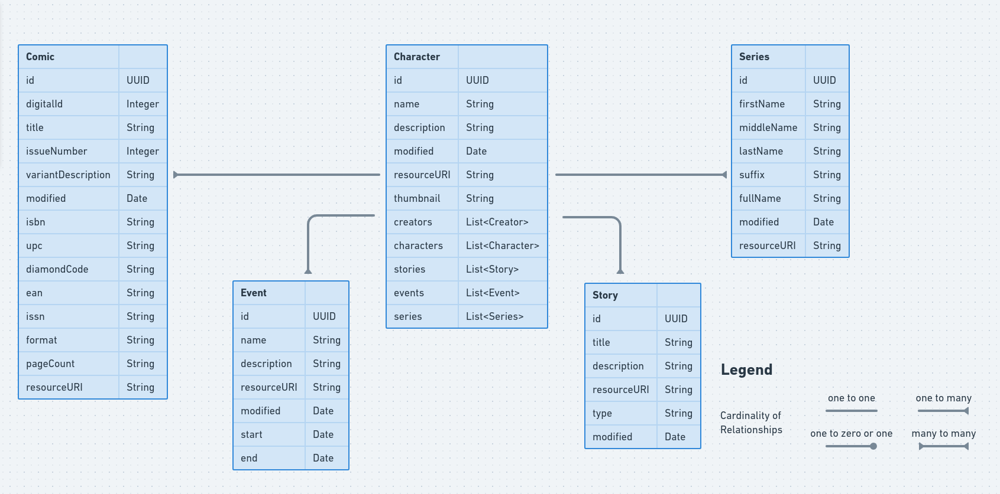

# Marvel API

### Resumo

Após Thanos destruir todo o universo foi dedicada uma missão para os *Vingadores* de recuperar tudo aquilo que foi destruído com as joias do infinito. Sendo assim, foi demandada uma tarefa para o desenvolvedor Frank Láercio de implementar a API que faz comunicação entre as pessoas e os heróis da Marvel. 

De modo a iniciar essa tarefa com uma maior rapidez foi decidido que a API seria feita com base nas seguintes tecnologias listadas abaixo:

- Spring Boot 2.4.4
- Java 11 SE
- Postgresql 12.6
- Swagger UI 2.6.1
- Junit 5.7.0
- Flyway
- Heroku

### Como obter o projeto

Para obter o projeto é bem simples, basta apenas executar os comandos abaixo:

```
# Clone este repositório
$ git clone <https://github.com/franklaercio/marvel-universe.git>

# Acesse a pasta do projeto
$ cd marvel-universive

```

Além disso a aplicação pode ser acessada por meio da URL abaixo:

```
# Hospedado no Heroku
https://marvel-universe-app.herokuapp.com
```

### CI/CD
Assim que é feito um novo commit foi desenvolvida uma actions que executa todo o processo de build da aplicação, incluindo os testes e caso tudo esteja funcionando corretamente a aplicação no Heroku é atualizada automaticamente. <br />
A action de build pode ser verificada no diretório abaixo:

```
# CI utilizando o Github Actions
cd .github/workflows/gradle.yml
```

### Scripts automatizados e conexão ao banco de dados

Primeiramente para ter acesso ao banco de dados deve-se seguir os seguintes passos:

1. Criar o usuário do banco de dados Postgresql como sendo **postgres** e com a senha **postgres**.
2. Criar uma *database* denominada **marvel**.
3. Verificar se porta **5432** está disponível para conexão.

Caso queira ajustar o banco de dados é simples, basta apenas acessar o arquivo [application.properties](http://application.properties) e alterar as configuração a seguir:

```jsx
spring.datasource.url=jdbc:postgresql://localhost:5432/marvel
spring.datasource.username=postgres
spring.datasource.password=postgres
```

Após isso está configurado, a aplicação irá sozinha criar as tabelas do banco de dados utilizando o Flyway. Ela rodará as *migrations* e também fará a inserção dos da aplicação, dado que não há nenhuma rota na API que permite fazer um cadastro de qualquer dado.

### Estrutura do projeto

A estrutura do projeto é baseada seguindo o modelo de DDD (*Domain Driven Design*), que é um padrão de estrutura de projeto orientada a domínio.

Dessa forma, primeiro foi atribuído o contexto de cada entidade do projeto como sendo *character*, *comic*, *event*, *creator*, *series* e *story*. Após isso, dentro de cada um desses contextos foi implementado o DDD, dividindo o projeto em 3 camadas *application*, *domain* e *infrastructure*. 

- *Application*: camada reservada para parte de interação direta com o usuário e é nessa camada que iremos encontrar os *endpoints* e as exceções que a aplicação pode retornar ao usuário.
- *Domain*: nessa parte do código poderá ser encontrado tudo aquilo que faz menção a abstração de algo da aplicação e é aqui que será destinado o local onde ficará definido o é um quadrinho, por exemplo, com seus atributos de título, valor, quantidade de páginas, etc.
- *Infrastructure*: local onde serão destinadas às partes do código que farão contado com o banco de dados e é aqui que ficarão as consultas utilizando JPA e onde serão populados os retornos aos usuários.

A seguir podemos observar como a estrutura do projeto está definida.

```
└── backend
    └── src
	└── main
	    └── java
		└── com.marvel.backend
			├── character
			│   ├── application
			│   ├── infrastructure
			│   └── domain
			├── comic
			│   ├── infrastructure
			│   └── domain
			├── creator
			|   ├── infrastructure
			│   └── domain
			├── event
			│   ├── infrastructure
			│   └── domain
			├── global
			│   ├── infrastructure
			│   └── domain
			├── series
			│   ├── infrastructure
			│   └── domain
			└── story
			    ├── infrastructure
			    └── domain
	        
```

<p>
   
<p>

### Testes da Aplicação

O desenvolvimento foi baseado seguindo TDD, ou seja, antes de ter implementado as funcionalidades os testes já tinham sidos implementados e foi seguido os pequenos ciclos de repetições que foram: elaborar o teste, executar o teste e esperar que ele falhe por falte de alguma classe não implementada ainda, criar a classe, executar o teste novamente e esperar que o teste retorne com sucesso, caso o contrário deve-se ajustar o teste e a classe até que o teste funcione conforme o esperado.

Além disso, para os testes serem executados da maneira esperada foram adicionadas as seguintes importações e no começo de cada teste deve-se ser adicionada a notação @SpringBootTest.

```jsx
testImplementation 'org.springframework.boot:spring-boot-starter-test'
testCompile 'org.junit.jupiter:junit-jupiter-engine:5.7.0'
testCompile 'org.mockito:mockito-junit-jupiter:3.8.0'
```

### Documentação

A documentação dos *endpoints* foi implementada seguindo a ferramenta de documentação Swagger UI. Para adicionar ela no projeto somente foi necessário adicionar as seguintes importações e criar uma classe na raiz do projeto, chamada SwaggerConfig.

```jsx
compile('io.springfox:springfox-swagger2:2.6.1')
compile('io.springfox:springfox-swagger-ui:2.6.1')
```

```jsx
@Configuration
@EnableSwagger2
public class SwaggerConfig {
    @Bean
    public Docket api() {
        return new Docket(DocumentationType.SWAGGER_2)
                .select()
                .apis(RequestHandlerSelectors.withClassAnnotation(RestController.class))
                .paths(PathSelectors.any())
                .build();
    }
}
```

### Licença

Este projeto é licenciado seguindo a normas da MIT License - veja o arquivo LICENSE.md para maiores detalhes.

Feito com :hearts: by Frank Laércio :wave:!
